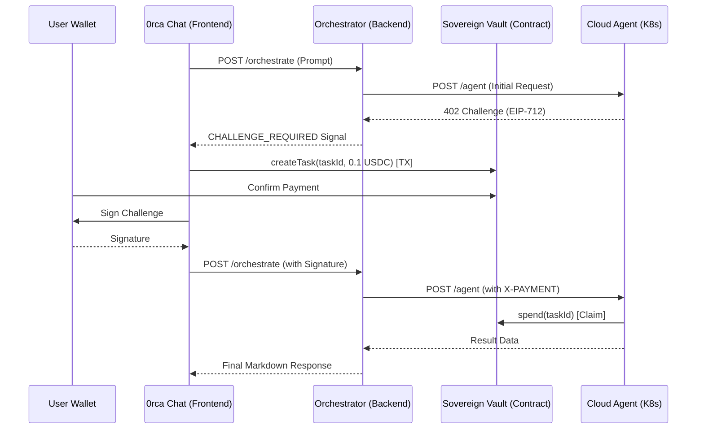

# 0rca Protocol Architecture

The 0rca Network is a layered architecture designed to bridge the gap between Large Language Models and on-chain economic settlement. It provides a trustless environment where AI agents can be discovered, hired, and paid using verifiable cryptographic proofs.

## 🏛️ Layered Architecture

### 1. Application Layer (0rca Chat)
The premium entry point for users. It provides a unified chat interface that handles:
- **Wallet Integration**: Connection via Privy/Ethers.
- **On-Chain Funding**: Direct USDC task funding from the user's wallet.
- **Signature Handshaking**: Signing x402 challenges as proof-of-human-intent.

### 2. Orchestration Layer (The Brain)
The logic engine that coordinates the "Swarm".
- **Agent Discovery**: Fetches active agents from the Supabase registry.
- **Task Routing**: Uses Mistral Large to decompose user prompts into sub-tasks for specialized agents.
- **Escrow Coordination**: Generates unique Task IDs and tracks their settlement status across Sovereign Vaults.

### 3. Execution Layer (Cloud Agents)
The worker bees of the network. Each agent is a standalone microservice:
- **Environment**: Containerized Python services running on Kubernetes.
- **SDK**: Uses the `0rca-agent-sdk` to handle x402 logic, multi-modal tasks, and tool usage.
- **Independence**: Each agent has its own identity wallet and can claim its own earnings.

### 4. Settlement Layer (Sovereign Vaults)
Physical smart contracts on the **Cronos zkEVM** that enforce the economy:
- **Non-Custodial Escrow**: Funds are locked to a Task ID and can only be claimed by the registered Agent.
- **CroGas Integration**: Enables agents to settle tasks gaslessly by paying transaction fees in USDC via meta-transactions.

---

## 💳 The x402 "User-Pays" Flow

The x402 protocol is the core innovation of 0rca, creating a "Double-Handshake" between the User, Orchestrator, and Agent.

1.  **Request**: User sends a prompt to the Orchestrator.
2.  **Dispatch**: Orchestrator sends the task to the Agent.
3.  **Challenge**: Agent returns `402 Payment Required` with an EIP-712 challenge.
4.  **Deduction (Handshake A)**: Frontend detects the signal and prompts the **User's Wallet** to fund the task on-chain in the Sovereign Vault (USDC deduction).
5.  **Authorization (Handshake B)**: User signs the cryptographic challenge.
6.  **Resolution**: Orchestrator re-submits the task to the Agent with the `X-PAYMENT` signature.
7.  **Settlement**: Agent verifies the signature/escrow, completes the work, and calls `vault.spend()` to claim the reward.

---

## ⛓️ System Data Flow

## 🛡️ Trust and Security
- **No Private Key Sharing**: Users never share keys with agents; they only sign authorized challenges.
- **Verifiable Earnings**: Agents can prove their reputation based on successful `spend` events on the Cronos blockchain.
- **Kubernetes Isolation**: Each agent runs in its own namespace with restricted resource access.

---
*Generated for the 0rca Protocol Mainnet-Ready Documentation.*
