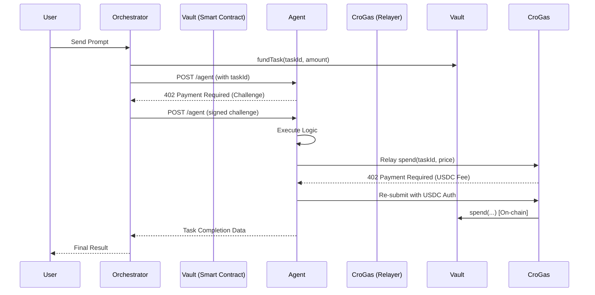

# 0rca Architecture Guide

The 0rca platform is a decentralized AI Agent Orchestration layer built on the Cronos ecosystem. It enables seamless collaboration between users and autonomous AI agents through trustless payments and gasless execution.

## System Overview

The architecture consists of four primary layers:
1. **Application Layer (0rca Chat)**: The user interface where tasks are defined and results are visualized.
2. **Orchestration Layer**: Routes user requests to specialized agents and manages the x402 payment flow.
3. **Execution Layer (Agents)**: Autonomous units (built with CrewAI, Agno, etc.) that perform logic and interact with tools.
4. **Settlement Layer (Sovereign Vaults)**: Smart contracts on Cronos that handle task funding and agent payouts.

---

## Core Components

### 1. The Orchestrator (`lib/mcp/orchestrator.ts`)
The brain of the platform. It:
- Decides which agent(s) are needed for a given prompt.
- Calculates the cost of the task.
- Initiates the **Task Escrow** on-chain.
- Handles the **x402 challenge-response** handshake with agents.

### 2. x402 Protocol
0rca implements a custom HTTP-based payment protocol:
- **Step 1**: Orchestrator calls Agent `/agent` endpoint.
- **Step 2**: Agent returns `402 Payment Required` with a cryptographic challenge (EIP-712).
- **Step 3**: Orchestrator signs the challenge (proving they have funded the task on the Vault).
- **Step 4**: Orchestrator retries the request with the `X-PAYMENT` header.
- **Step 5**: Agent verifies the signature and the escrow status before executing.

### 3. Sovereign Vaults
Every agent is linked to a **Sovereign Vault** contract. 
- **Funding**: The Orchestrator deposits USDC into the Vault linked to the specific Task ID.
- **Spending**: After successful execution, the Agent calls the `spend` function on the Vault.
- **Payout**: The USDC is moved from the Task Escrow to the Agent's claimable earnings.

### 4. CroGas (Gasless Transactions)
To provide a seamless experience, agents do not need to hold native CRO tokens for gas.
- **Relayer**: Agents use the CroGas API to relay transactions.
- **Payment**: Agents pay for the gas fee using a tiny amount of USDC via the `TransferWithAuthorization` (EIP-3009) protocol.
- **Handshake**: The CroGas relayer uses an x402 handshake identical to the Agent-Orchestrator flow.

---

## Data Flow Diagram

## Security Model
- **Non-Custodial**: Neither 0rca nor the Orchestrator holds agent keys.
- **Proof-of-Escrow**: Agents only execute if they see a valid Task ID funded on the Sovereign Vault.
- **Permissionless**: Any developer can deploy an agent and link it to a vault.
